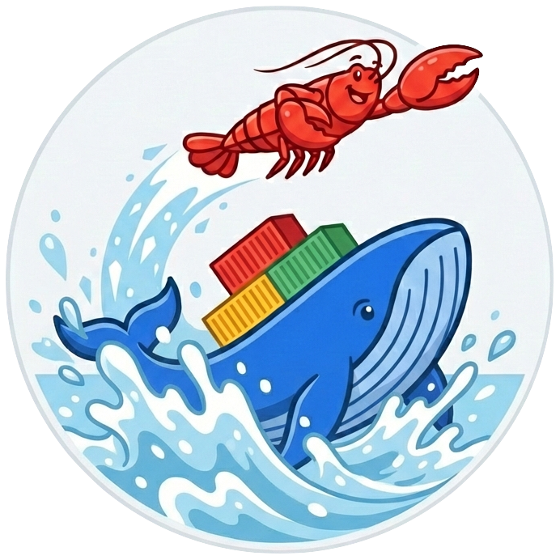

<p align="center">
  
</p>

# OpenClaw Docker

OpenClaw in Docker - self-hosted AI agents made easy. Persistent workspaces, web-based 3-step setup (no CLI required), portable across any infrastructure, one-command deployment, built-in backup/restore, and isolated environment with no dependency conflicts.

## Features

- **Persistent Storage**: Configuration, credentials, and workspace survive container restarts
- **Web Setup UI**: Multi-step onboarding wizard at `/get-started` - no CLI required
- **One-Command Deployment**: `docker compose up -d` and you're running
- **Portable**: Runs anywhere Docker runs - local machine, VPS, cloud, or self-hosted
- **Backup/Restore**: Export and import full deployment state as a single archive
- **Linuxbrew**: Built-in Homebrew for installing skill dependencies (go, ffmpeg, etc.)
- **No Dependency Hell**: Fully isolated environment with everything pre-configured

## Quick Start

### 1. Clone and Configure

```bash
git clone https://github.com/zjuuu/openclaw-docker.git
cd openclaw-docker
```

### 2. Set Environment Variables

```bash
cp .env.example .env
```

Edit `.env` and set your password:

```env
SETUP_PASSWORD=your_strong_password_here
```

### 3. Run

```bash
docker compose up -d
```

### 4. Complete Setup

1. Visit `http://localhost:8080`
2. Enter your SETUP_PASSWORD when prompted
3. **Step 1**: Choose AI provider and enter API key
4. **Step 2**: Configure messaging channels (Telegram, Discord, or Slack)
5. **Step 3**: Click "Initialize OpenClaw"

Done! Your AI agent is now running.

## Environment Variables

| Variable | Required | Default | Description |
|----------|----------|---------|-------------|
| `SETUP_PASSWORD` | Yes | - | Password for `/get-started` UI |
| `OPENCLAW_DATA_DIR` | No | `/data` | Base data directory |
| `OPENCLAW_STATE_DIR` | No | `/data/.openclaw` | Config and credentials |
| `OPENCLAW_WORKSPACE_DIR` | No | `/data/workspace` | Skills and memory |

## Persistent Storage

All data is stored in a Docker volume mounted at `/data`:

```
/data/
├── .openclaw/           # Configuration and credentials
│   └── openclaw.json    # Main config
├── workspace/           # Skills and memory
├── .homebrew-cache/     # Linuxbrew cache
└── .npm-cache/          # npm cache for skills
```

## AI Providers

OpenClaw supports multiple AI providers out of the box:

- **OpenAI** - GPT-4, GPT-4o, etc.
- **Anthropic** - Claude models
- **OpenRouter** - Access to many models
- **Gemini** - Google's AI models
- **Custom** - Any OpenAI-compatible API endpoint

## Messaging Channels

Connect your agent to:

- **Telegram** - DM and group chat support
- **Discord** - Direct messages and server integration
- **Slack** - Workspace integration with bot/app tokens
- **Line** - Webhook-based messaging

## Security

### Authentication

| Endpoint | Protection |
|----------|------------|
| `/get-started` | Public (login page only) |
| `/get-started/api/*` | Session cookie |
| `/openclaw/*` | Session cookie |
| WebSocket | Session cookie |

### Public Webhook Endpoints

These endpoints use their own authentication:

| Endpoint | Purpose |
|----------|---------|
| `/slack/events` | Slack webhook (signing secret) |
| `/line/webhook` | Line webhook (signature validation) |

### Session Security

- **HttpOnly cookie**: Not accessible via JavaScript
- **SameSite=Strict**: CSRF protection
- **24-hour expiry**: Auto-logout after 24 hours

### Container Security

The container runs as root by default. While running as a non-root user (e.g., `node` UID 1000) would reduce the attack surface, it severely limits OpenClaw's ability to install packages and run system commands.

**Why root is risky**: The container's root user shares UID 0 with the host. If container isolation fails (kernel vulnerabilities, misconfigured mounts, or extra capabilities), an attacker could escape to the host system.

**Recommended approaches**:

1. **Accept the risk**
   - Rely on your platform's container isolation and network policies
   - Suitable for development and sandbox environments
   - Avoid mounting sensitive host paths or running with `--privileged`

2. **Use rootless container runtime**
   - Deploy with Podman or rootless Docker where UID 0 in the container maps to an unprivileged UID on the host
   - Provides full root functionality inside the container without host-level root access
   - Requires host/provider configuration

## Backup & Restore

**Export**: Setup UI > Advanced Tools > "Download Backup"

**Import**: Setup UI > Advanced Tools > Upload `.tar.gz` > "Import"

Or via command line:

```bash
# Backup
docker compose exec openclaw tar -czvf /tmp/backup.tar.gz -C /data .
docker compose cp openclaw:/tmp/backup.tar.gz ./backup.tar.gz

# Restore
docker compose cp ./backup.tar.gz openclaw:/tmp/backup.tar.gz
docker compose exec openclaw tar -xzvf /tmp/backup.tar.gz -C /data
docker compose restart
```

## Local Development

### Setup UI Development

```bash
cd ui
npm install
npm run dev
```

The UI dev server runs at `http://localhost:5173/get-started/` with auth bypassed.

### Run Server Locally

```bash
npm install
SETUP_PASSWORD=test OPENCLAW_DATA_DIR=./.tmpdata node src/server.js
```

## Project Structure

```
openclaw-docker/
├── ui/                    # React setup UI (Vite)
│   ├── src/
│   │   ├── App.jsx        # Multi-step wizard
│   │   └── components/
│   └── package.json
├── src/
│   └── server.js          # Express API server
├── scripts/
│   └── entrypoint.sh      # Environment setup
├── Dockerfile             # Multi-stage build
├── docker-compose.yml     # Container orchestration
└── package.json
```

## Architecture

```
┌─────────────────────────────────────────────────────────────┐
│                     Docker Container                         │
│                                                              │
│  entrypoint.sh                                               │
│    └─> Setup directories and environment                    │
│    └─> Start server                                          │
│                                                              │
│  ┌──────────────────┐         ┌────────────────────┐        │
│  │  Express Server  │────────▶│  OpenClaw Gateway  │        │
│  │  (port 8080)     │  proxy  │  (port 18789)      │        │
│  │  + React UI      │◀────────│                    │        │
│  └──────────────────┘         └────────────────────┘        │
│           │                            │                     │
│           └────────────────────────────┘                     │
│                        │                                     │
│              /data (Persistent Volume)                       │
│                                                              │
│  /home/linuxbrew/.linuxbrew (Homebrew)                      │
└─────────────────────────────────────────────────────────────┘
```

## Updating

Pull the latest image and restart:

```bash
docker compose pull
docker compose up -d
```

Your data persists in the volume - only the container updates.

## Troubleshooting

**SETUP_PASSWORD not set**: Make sure your `.env` file exists and contains `SETUP_PASSWORD`.

**Gateway won't start**: Use Console (Advanced Tools) > run `gw:restart`.

**Skill install fails**: Check logs - Homebrew may need time to update on first use.

**Bot doesn't respond after restart**: Gateway auto-starts on restart. Check logs with `docker compose logs -f`.

**Port already in use**: Change the port mapping in `docker-compose.yml` (e.g., `8081:8080`).

## Contributing

Contributions are welcome! Please open an issue or submit a pull request.

## License

MIT License - see [LICENSE](LICENSE) for details.

## Acknowledgments

This project is based on [OpenClaw](https://github.com/openclaw/openclaw)